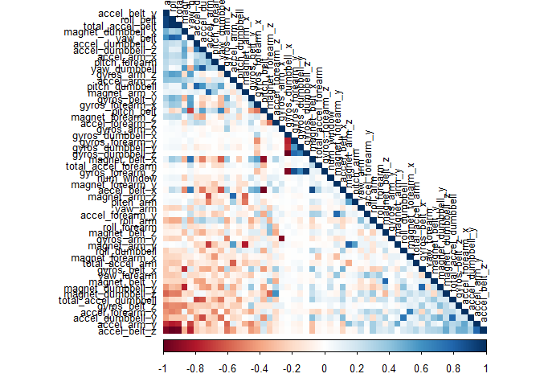
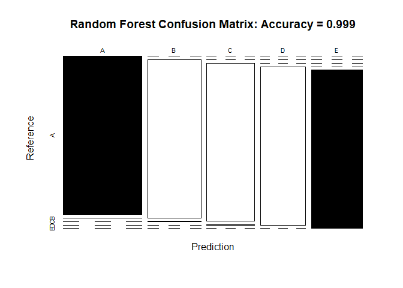
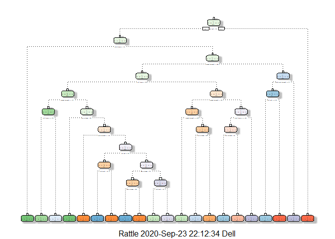
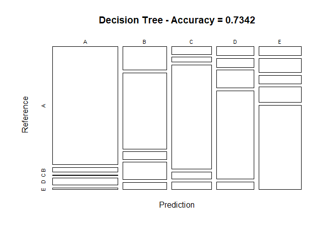
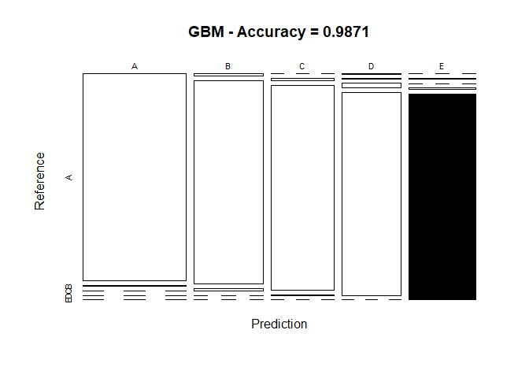

Practical Machine Learning Project : Prediction Assignment Writeup

1. Overview

The aim of the project is to predict the manner in which the participants performed some exercises as described in the “classe” variable in the training set. The machine learning algorithm described here is applied to the 20 test cases available in the test data and the predictions are submitted in appropriate format to the Course Project Prediction Quiz.

2. Background

Using devices such as Jawbone Up, Nike FuelBand, and Fitbit it is now possible to collect a large amount of data about personal activity relatively inexpensively. These type of devices are part of the quantified self movement - a group of enthusiasts who take measurements about themselves regularly to improve their health, to find patterns in their behavior, or because they are tech geeks. One thing that people regularly do is quantify how much of a particular activity they do, but they rarely quantify how well they do it. In this project, the data is used from accelerometers on the belt, forearm, arm, and dumbell of 6 participants. They were asked to perform barbell lifts correctly and incorrectly in 5 different ways. 

3. Data Loading and Processing

We will be loading the necessary R libraries for running the analysis


```r
library(lattice)
library(ggplot2)
```

```
## Warning: package 'ggplot2' was built under R version 4.0.2
```

```r
library(caret)
```

```
## Warning: package 'caret' was built under R version 4.0.2
```

```r
library(rpart)
library(rpart.plot)
```

```
## Warning: package 'rpart.plot' was built under R version 4.0.2
```

```r
library(bitops)
library(tibble)
library(rattle)
```

```
## Warning: package 'rattle' was built under R version 4.0.2
```

```
## Rattle: A free graphical interface for data science with R.
## Version 5.4.0 Copyright (c) 2006-2020 Togaware Pty Ltd.
## Type 'rattle()' to shake, rattle, and roll your data.
```

```r
library(randomForest)
```

```
## Warning: package 'randomForest' was built under R version 4.0.2
```

```
## randomForest 4.6-14
```

```
## Type rfNews() to see new features/changes/bug fixes.
```

```
## 
## Attaching package: 'randomForest'
```

```
## The following object is masked from 'package:rattle':
## 
##     importance
```

```
## The following object is masked from 'package:ggplot2':
## 
##     margin
```

```r
library(corrplot)
```

```
## Warning: package 'corrplot' was built under R version 4.0.2
```

```
## corrplot 0.84 loaded
```

```r
library(gbm)
```

```
## Warning: package 'gbm' was built under R version 4.0.2
```

```
## Loaded gbm 2.1.8
```

```r
set.seed(12345)
```

4. Getting and Cleaning Data

The next step is to load the dataset from the URL provided. The training dataset is then sorted into Training set (70% of the data) for the modeling process and a Test set (with the remaining 30%) for the validations. The testing dataset is not changed and will only be used for the quiz results generation.


```r
#Setting the URL for downloading the datasets:
UrlTrain <- "http://d396qusza40orc.cloudfront.net/predmachlearn/pml-training.csv"
UrlTest  <- "http://d396qusza40orc.cloudfront.net/predmachlearn/pml-testing.csv"

#Downloading the datasets:
training <- read.csv(url(UrlTrain))
testing  <- read.csv(url(UrlTest))

#Sorting the training dataset 
inTrain  <- createDataPartition(training$classe, p=0.7, list=FALSE)
TrainSet <- training[inTrain, ]
TestSet  <- training[-inTrain, ]
dim(TrainSet)
```

```
## [1] 13737   160
```

```r
dim(TestSet)
```

```
## [1] 5885  160
```

```r
#Removing variables with Nearly Zero Variance
NZV <- nearZeroVar(TrainSet)
TrainSet <- TrainSet[, -NZV]
TestSet  <- TestSet[, -NZV]
dim(TrainSet)
```

```
## [1] 13737   104
```

```r
dim(TestSet)
```

```
## [1] 5885  104
```

```r
#Removing variables that are NA
AllNA    <- sapply(TrainSet, function(x) mean(is.na(x))) > 0.95
TrainSet <- TrainSet[, AllNA==FALSE]
TestSet  <- TestSet[, AllNA==FALSE]
dim(TrainSet)
```

```
## [1] 13737    59
```

```r
dim(TestSet)
```

```
## [1] 5885   59
```

```r
#Removing identification only variables (columns 1 to 5)
TrainSet <- TrainSet[, -(1:5)]
TestSet  <- TestSet[, -(1:5)]
dim(TrainSet)
```

```
## [1] 13737    54
```

```r
dim(TestSet)
```

```
## [1] 5885   54
```

5. Correlation Analysis


```r
corMatrix <- cor(TrainSet[, -54])
corrplot(corMatrix, order = "FPC", method = "color", type = "lower", 
         tl.cex = 0.8, tl.col = rgb(0, 0, 0))
```

<!-- -->

The highly correlated variables are shown in dark colors in the graph above.

6. Model Building

Three methods will be applied to model the regressions (in the Train dataset) and the best one (with higher accuracy when applied to the Test dataset) will be used for the quiz predictions. The methods are: Random Forests, Decision Tree and Generalized Boosted Model, as described below.
A Confusion Matrix is plotted at the end of each analysis to better visualize the accuracy of the models.

a. Random Forest Method:


```r
#Model Fit
controlRf <- trainControl(method="cv", 5)
modelRf <- train(classe ~ ., data=TrainSet, method="rf", trControl=controlRf, ntree=250)
modelRf$finalModel
```

```
## 
## Call:
##  randomForest(x = x, y = y, ntree = 250, mtry = param$mtry) 
##                Type of random forest: classification
##                      Number of trees: 250
## No. of variables tried at each split: 27
## 
##         OOB estimate of  error rate: 0.17%
## Confusion matrix:
##      A    B    C    D    E  class.error
## A 3905    0    0    0    1 0.0002560164
## B    5 2650    2    1    0 0.0030097818
## C    0    3 2392    1    0 0.0016694491
## D    0    0    9 2243    0 0.0039964476
## E    0    0    0    2 2523 0.0007920792
```

```r
#Prediction on Test dataset
predictRf <- predict(modelRf, TestSet)
cmrf <- confusionMatrix(predictRf,as.factor(TestSet$classe))

#Plot matrix results
plot(cmrf$table, col = cmrf$byClass, main = paste("Random Forest Confusion Matrix: Accuracy =", round(cmrf$overall['Accuracy'], 4)))
```

<!-- -->

b. Decision Trees Method:


```r
#Model Fit
set.seed(12345)
modFitDecTree <- rpart(classe ~ ., data=TrainSet, method="class")
fancyRpartPlot(modFitDecTree)
```

<!-- -->

```r
#Prediction on Test dataset
predictDecTree <- predict(modFitDecTree, newdata=TestSet, type="class")
confMatDecTree <- confusionMatrix(as.factor(TestSet$classe),predictDecTree)
confMatDecTree
```

```
## Confusion Matrix and Statistics
## 
##           Reference
## Prediction    A    B    C    D    E
##          A 1502   58    4   90   20
##          B  201  660   66  148   64
##          C   59   37  815   54   61
##          D   66   64  129  648   57
##          E   74  114   72  126  696
## 
## Overall Statistics
##                                           
##                Accuracy : 0.7342          
##                  95% CI : (0.7228, 0.7455)
##     No Information Rate : 0.3232          
##     P-Value [Acc > NIR] : < 2.2e-16       
##                                           
##                   Kappa : 0.6625          
##                                           
##  Mcnemar's Test P-Value : < 2.2e-16       
## 
## Statistics by Class:
## 
##                      Class: A Class: B Class: C Class: D Class: E
## Sensitivity            0.7897   0.7074   0.7505   0.6079   0.7751
## Specificity            0.9568   0.9033   0.9560   0.9344   0.9226
## Pos Pred Value         0.8973   0.5795   0.7943   0.6722   0.6433
## Neg Pred Value         0.9050   0.9425   0.9442   0.9151   0.9579
## Prevalence             0.3232   0.1585   0.1845   0.1811   0.1526
## Detection Rate         0.2552   0.1121   0.1385   0.1101   0.1183
## Detection Prevalence   0.2845   0.1935   0.1743   0.1638   0.1839
## Balanced Accuracy      0.8733   0.8053   0.8532   0.7712   0.8488
```

```r
#Plot matrix results
plot(confMatDecTree$table, col = confMatDecTree$byClass, 
     main = paste("Decision Tree - Accuracy =",
                  round(confMatDecTree$overall['Accuracy'], 4)))
```

<!-- -->

c. Generalised Boosted Model Method:

```r
#Model fit
set.seed(12345)
controlGBM <- trainControl(method = "repeatedcv", number = 5, repeats = 1)
modFitGBM  <- train(classe ~ ., data=TrainSet, method = "gbm",
                    trControl = controlGBM, verbose = FALSE)
modFitGBM$finalModel
```

```
## A gradient boosted model with multinomial loss function.
## 150 iterations were performed.
## There were 53 predictors of which 53 had non-zero influence.
```

```r
#Prediction on Test dataset
predictGBM <- predict(modFitGBM, newdata=TestSet)
confMatGBM <- confusionMatrix(as.factor (TestSet$classe),predictGBM)
confMatGBM
```

```
## Confusion Matrix and Statistics
## 
##           Reference
## Prediction    A    B    C    D    E
##          A 1668    6    0    0    0
##          B   12 1115   12    0    0
##          C    0   12 1012    2    0
##          D    1    1   21  941    0
##          E    0    3    0    6 1073
## 
## Overall Statistics
##                                           
##                Accuracy : 0.9871          
##                  95% CI : (0.9839, 0.9898)
##     No Information Rate : 0.2856          
##     P-Value [Acc > NIR] : < 2.2e-16       
##                                           
##                   Kappa : 0.9837          
##                                           
##  Mcnemar's Test P-Value : NA              
## 
## Statistics by Class:
## 
##                      Class: A Class: B Class: C Class: D Class: E
## Sensitivity            0.9923   0.9807   0.9684   0.9916   1.0000
## Specificity            0.9986   0.9949   0.9971   0.9953   0.9981
## Pos Pred Value         0.9964   0.9789   0.9864   0.9761   0.9917
## Neg Pred Value         0.9969   0.9954   0.9932   0.9984   1.0000
## Prevalence             0.2856   0.1932   0.1776   0.1613   0.1823
## Detection Rate         0.2834   0.1895   0.1720   0.1599   0.1823
## Detection Prevalence   0.2845   0.1935   0.1743   0.1638   0.1839
## Balanced Accuracy      0.9954   0.9878   0.9828   0.9935   0.9991
```

```r
#Plot matrix results
plot(confMatGBM$table, col = confMatGBM$byClass, 
     main = paste("GBM - Accuracy =", round(confMatGBM$overall['Accuracy'], 4)))
```

<!-- -->

7. Applying the chosen Model

The accuracy of the 3 regression modeling methods above are:

Random Forest : 0.9966
Decision Tree : 0.7368
GBM : 0.9857

In that case, the Random Forest model will be applied to testing dataset.


```r
results <- predict(modelRf, newdata=testing)
results
```

```
##  [1] B A B A A E D B A A B C B A E E A B B B
## Levels: A B C D E
```
